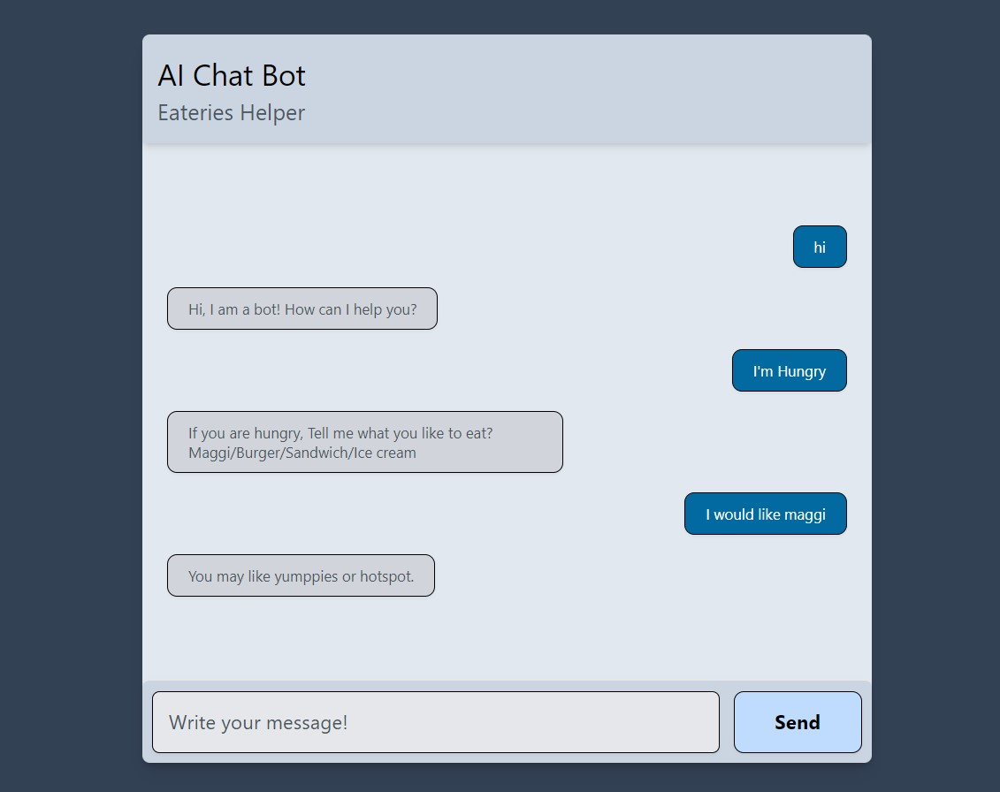

# AI Chatbot
This is a chatbot that helps in finding Eateries in BITS Pilani, Hyderabad Campus.

It is made using next.js and tailwind css.

## Steps to run locally
You would need node.js and npm installed in your system. After that follow the steps as below :
1. clone the repo or downlod the code as zip
1. go to the project directory and run following
```
npm install
npm run dev
```

## Example
